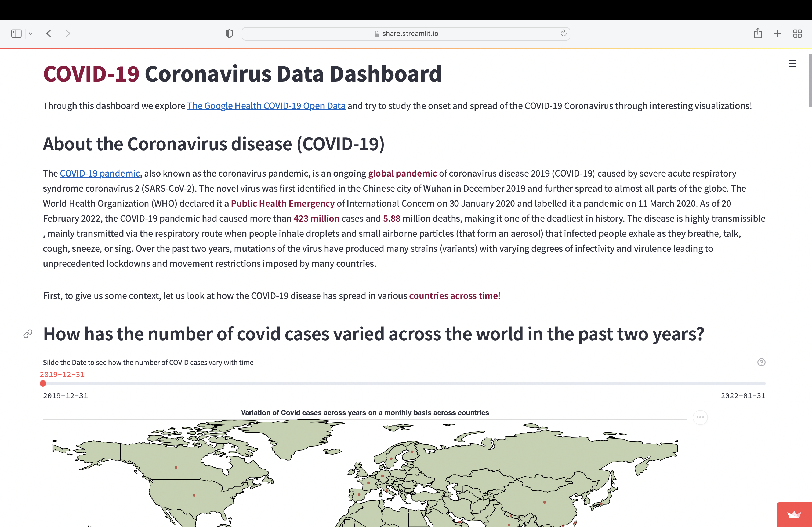

# COVID-19 Coronavirus Data Dashboard

This dashboard informs the user about the spread of the <b> COVID-19 Coronavirus</b> in the <b>United States</b>. Through the visualizations, the viewer
can gain insight into various parameters such as the trend in cases, vaccination, hospitalizations and deaths. The dashboard also aids in 
determining how COVID-19 has affected the demographics of the population and the effect of the containment measures taken to prevent it's spread. 
Through this dashboard we aim to inform the user about the trends and the spread of the 
COVID-19 Coronavirus. 

## Project Goals

The main goal of this dashboard is for the user to find out what was the <b>progression</b> and <b>nature</b>
of the COVID-19 Coronavirus in the United States. The user can also gain insight into the 
effect of the virus across the <b>demography</b> of the US and the effect of containment measures taken to prevent the spread of COVID-19. 

## Design

We wanted to first give the user a high level perspective about the trend in COVID-19 cases across the countries of the world.
<ul><li>We decided to use a map visualization which depicts the cases in the countries
across time by a time slider </li>
<li>Using area of the bubble to indicate the number of cases, it becomes easy for the viewer to perceive 
the general trend</li></ul>
Since the motive of this visualization was to give context and not exact numbers, it made sense to use a general estimate such as a bubble over having 
a bar chart which would make it very condensed to understand.

With the understanding from the previous graph that the United States has experienced the highest number of cases, we now wanted to shift the viewer's focus onto the United States in 
terms of the variation in cases, vaccination, hospitalization and
deaths in the US. 
<ul>
<li> We decided to have a multi select line chart and the user can choose which parameter(s) to visualize</li>
<li>The viewer can compare them and gain insight into
the nature of the disease as well as the effect of vaccinations</li>
<li>A static line chart to compare a few important lines was also made due to scale imbalance between the parameters. 
This provided more flexibility to the user to explore.</li>
</ul>

With the insights gained from the earlier visualizations, we now wanted to look into how COVID-19 affected different groups of the population in the US. 
Did it affect Males more than Females?   
How did it affect the various age groups through time over the past two years? 
<ul>
<li>We first employed a pie chart showing the total distribution </li>
<li>Then, we used an interactive multi-view coordination which connects the progression in cases across gender and age groups through time to enable the user to view both the categories across time</li> 
</ul>

Preventive measures such as restrictions and lockdowns were imposed by countries to control the spread of the Coronavirus. 
To understand the effect of the measures, we now show the user change in mobility in US by comparing
it with that of another country - New Zealand. 
We used a streamgraph to depict this phenomenon since there were multiple categories and the streamgraph could be
used to interpret the change in trend of mobility of the people of the country

Finally, a question we had in mind was if weather affects covid. Since the user might notice
that the peaks seen occur usually during the cooler seasons, we tried to analyze if there existed any correlation between them. 
To do this, We used a correlation matrix to demonstrate the dependence between variables such as rainfall, temperature etc. with 
the number of cases

## Development

<ul>
<li>The initial step we took was to have a discussion regarding our interests to choose the domain of the dataset and 
identify appropriate questions we wanted to answer from datasets in these domains</li>

<li>We then divide the task of dataset selection by exploring existing datasets and shortlist a few that particularly interested us</li>
<li>Each one of us analyzed a few datasets and performed some basic data wrangling and 
exlporatory analysis to explore the feasibility and quality of the datasets in being able to provide insights regarding the 
questions we posed and also looked into the possibility of identifying new questions. This took around 3 hrs per person. </li>
<li>Next, we discussed our findings and chose the <a href = 'https://goo.gle/covid-19-open-data'>Google health COVID-19 Open Dataset </a>. </li>
<li>We split the work in terms of the visualizations between the two team members and worked on them separately for around 6 hours in total</li>
<li>The map visualization consumed a major chunk of our time since Altair does not have very good support for geographic map visualizations.
The range of covid cases was very large. Thus, deciding the range for the size of the circles also took time as we needed to get a representative and comparable size while ensuring that they aren't very huge
due to scale imbalance that the circle correpsonding to one country would eclipse the entire continent!</li>
<li>Next we worked on weaving a story through the visualizations by writing textual content to engage the user.</li>
<li>We then worked on finalising the alignment and adding a nice aesthetic to the dashboard.
In total, we spent around 10 hrs per person for this assignment over the past month. </li>
</ul>

## Success Story

Through the visualizations we were able to answer the questions we initially posed. A few interesting scenarios was that the 
number of cases peaked around winter time the past two years. To investigate this further we plotted a correlation plot to study the influence of weather parameters.
However, there seemed to be no significant correlation. We then realised that there must be some confounding variable that is causing this behavior. 
We then concluded that the cases must have actually increased due to Christmas and the holiday season rather than the temperature aspect.
This showed us how important it is to not just jump to conclusions and verify the result to the best of our abilities before reporting it.

Through the visualizations we were also able to see the possible effect of vaccinations because even though the number of cases increased by a large amount, the number of deaths remained around the same level.
But in order to ascertain if it was the vaccinations or whether a characteristic property of the mutation of the COVID19 virus that behaves differently 
from the earlier ones, is something that needs to be explored before we can concretely establish the efficacy of vaccinations from this data.
